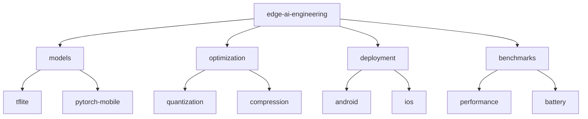

# Edge AI Engineering 📱

[](https://www.python.org/downloads/)
[](https://www.tensorflow.org/lite)
[](https://pytorch.org/mobile)
[](https://developer.nvidia.com/cuda-toolkit)
[](LICENSE)

> Optimized machine learning models for edge and mobile devices. Showcasing efficient model deployment, optimization techniques, and real-world edge AI applications.

[Features](#features) • [Installation](#installation) • [Quick Start](#quick-start) • [Documentation](#documentation) • [Contributing](#contributing)

## 📑 Table of Contents
- [Features](#features)
- [Project Structure](#project-structure)
- [Prerequisites](#prerequisites)
- [Installation](#installation)
- [Quick Start](#quick-start)
- [Documentation](#documentation)
  - [Models](#models)
  - [Optimization](#optimization)
  - [Benchmarks](#benchmarks)
- [Contributing](#contributing)
- [Versioning](#versioning)
- [Authors](#authors)
- [Citation](#citation)
- [License](#license)
- [Acknowledgments](#acknowledgments)

## ✨ Features
- Model quantization and optimization
- Mobile-first architectures
- Battery-efficient inference
- Cross-platform deployment
- Edge-optimized pipelines

## 📁 Project Structure



<details>
<summary>Click to expand full directory structure</summary>

```plaintext
edge-ai-engineering/
├── models/            # Model implementations
│   ├── tflite/       # TensorFlow Lite models
│   └── pytorch/      # PyTorch Mobile models
├── optimization/      # Optimization tools
│   ├── quantization/ # Model quantization
│   └── compression/  # Model compression
├── deployment/       # Platform-specific deployment
│   ├── android/     # Android deployment
│   └── ios/         # iOS deployment
├── benchmarks/       # Performance testing
└── README.md         # Documentation
```
</details>

## 🔧 Prerequisites
- Python 3.8+
- TensorFlow Lite 2.14+
- PyTorch Mobile 2.2+
- Android SDK/NDK
- Xcode (for iOS)

## 📦 Installation

```bash
# Clone repository
git clone https://github.com/BjornMelin/edge-ai-engineering.git
cd edge-ai-engineering

# Create environment
python -m venv venv
source venv/bin/activate

# Install dependencies
pip install -r requirements.txt
```

## 🚀 Quick Start

```python
from edge_ai import optimization, deployment

# Optimize model for mobile
optimized_model = optimization.quantize_for_mobile(
    model,
    target_platform="android",
    quantization="int8"
)

# Deploy to device
deployment = deployment.MobileDeployment(
    model=optimized_model,
    platform="android",
    optimize_battery=True
)

# Generate deployment package
deployment.export()
```

## 📚 Documentation

### Models

| Model | Task | Size | Latency (ms) |
|-------|------|------|--------------|
| MobileNetV3 | Classification | 4MB | 15 |
| TinyYOLO | Detection | 8MB | 25 |
| MobileViT | Vision | 6MB | 20 |

### Optimization
- Int8 quantization
- Model pruning
- Architecture optimization
- Memory footprint reduction

### Benchmarks
Performance on different devices:

| Device | Model | Battery Impact | FPS | Memory |
|--------|-------|----------------|-----|---------|
| Pixel 6 | MobileNet | 2%/hr | 30 | 120MB |
| iPhone 13 | TinyYOLO | 3%/hr | 25 | 150MB |
| RPi 4 | MobileViT | N/A | 15 | 200MB |

## 🤝 Contributing
- [Contributing Guidelines](CONTRIBUTING.md)
- [Code of Conduct](CODE_OF_CONDUCT.md)
- [Development Guide](DEVELOPMENT.md)

## 📌 Versioning
We use [SemVer](http://semver.org/) for versioning. For available versions, see the [tags on this repository](https://github.com/BjornMelin/edge-ai-engineering/tags).

## ✍️ Authors
**Bjorn Melin**
- GitHub: [@BjornMelin](https://github.com/BjornMelin)
- LinkedIn: [Bjorn Melin](https://linkedin.com/in/bjorn-melin)

## 📝 Citation
```bibtex
@misc{melin2024edgeaiengineering,
  author = {Melin, Bjorn},
  title = {Edge AI Engineering: Optimized Mobile Machine Learning},
  year = {2024},
  publisher = {GitHub},
  url = {https://github.com/BjornMelin/edge-ai-engineering}
}
```

## 📄 License
This project is licensed under the MIT License - see the [LICENSE](LICENSE) file for details.

## 🙏 Acknowledgments
- TensorFlow Lite team
- PyTorch Mobile developers
- Mobile ML community
- Edge computing researchers

---
Made with 📱 and ❤️ by Bjorn Melin
